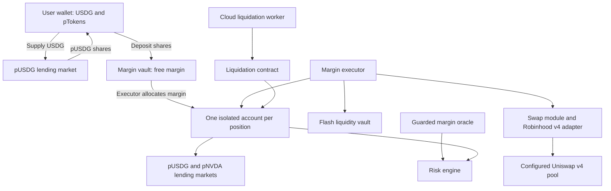

# Peridot Robinhood margin: frontend implementation guide

This guide explains the deployed NVDA/USDG isolated-margin product, the contracts behind it, and the reads and transactions needed to build its frontend. It is for a frontend developer receiving this folder without access to the contracts repository.

**Network:** Robinhood Chain mainnet, chain ID **4663**, native gas token **ETH**. RPC: `https://rpc.mainnet.chain.robinhood.com`. Explorer: `https://robinhoodchain.blockscout.com`.

Use [manifest.json](manifest.json) as the machine-readable address and ABI map. All 16 ABI files referenced there are included alongside this guide. Call the addresses below with their associated ABIs, including when the address is a proxy. Do not use implementation addresses as application targets.

## 1. What has been built

There are three connected layers:

1. **Boosted lending markets.** Users supply USDG or NVDA and receive pUSDG or pNVDA shares. These shares represent claims on lending-market assets, including assets allocated to the underlying paired liquidity vault. Share exchange rates can change with interest, strategy results and losses.
2. **Isolated margin.** Users deposit pUSDG into a margin vault, then allocate shares to individual long or short positions. Each position has its own account contract holding assets and debt. The executor coordinates opening, closing, collateral additions and repayment. Free margin is not automatically added to an unhealthy position.
3. **Liquidation automation.** A DigitalOcean worker monitors position health and can call the liquidation contract using a dedicated wallet. A PostgreSQL journal tracks its transaction attempts. The worker does not open users' positions or sign on their behalf.

The underlying paired liquidity vault and the **margin vault** are different contracts. The paired vault manages stock/USDG liquidity; the margin vault manages users' free shares and position allocations. The margin UI normally interacts with the lending markets and margin contracts, not the paired vault directly.



### Recorded deployment status — 2026-09-20

- Both directions are configured for **up to 5×**, with 20% initial margin and 10% maintenance margin.
- Caps are **$2 gross assets and $1 debt per position**. There is no aggregate protocol cap or tester allowlist in these settings.
- Opens and flash lending were verified unpaused at block **68081036**.
- Dedicated keeper funding and executing-worker health were verified: 0.002 ETH, `gasReady=true`, `executionEnabled=true`, no positions observed. A live cloud liquidation has not yet been demonstrated.
- At the later oracle check, block **68118086**, both markets returned `marketPriceable=false`.

These are dated observations, not an availability API. The frontend must re-read live contract state. `manifest.tradingReady=true` records verified contract activation; it does not mean prices, liquidity or keeper health are currently available. The documentation-only preparation of this guide did not perform another live check.

## 2. Contract addresses and responsibilities

### Tokens and lending markets

| Symbol / role | Address | Decimals |
| --- | --- | --- |
| USDG underlying | `0x5fc5360D0400a0Fd4f2af552ADD042D716F1d168` | 6 |
| NVDA stock-token underlying | `0xd0601CE157Db5bdC3162BbaC2a2C8aF5320D9EEC` | 18 |
| pUSDG (boosted USDG market) | `0x55aed0569c8f0d166d71face57b57c2f2624a563` | 8 |
| pNVDA (boosted NVDA market) | `0xa155cccb986774ae818b3f10f07d01d1b7a47b26` | 8 |

Both lending-market addresses use `RobinhoodBoostedDelegate.abi.json`. The ABI describes the implementation interface; calls go to the market addresses above. For USDG/NVDA approvals and balances, use `IERC20.abi.json`. That minimal ERC-20 ABI does not necessarily include metadata methods; use the pToken ABI for pToken metadata and the manifest for the underlying decimals below.

### Margin contracts

| Manifest key / contract | Mainnet call address | Responsibility |
| --- | --- | --- |
| `executor` / [IsolatedMarginExecutorUpgradeable](IsolatedMarginExecutorUpgradeable.abi.json) | `0x6A45Ae86bD992d250580d08D340A06A04D478977` | User entry point for open, close, add collateral, repayment and debt-free exit. |
| `marginVault` / [IsolatedMarginVaultUpgradeable](IsolatedMarginVaultUpgradeable.abi.json) | `0x04D4A5555b7a37017A67B4D21A1Da5838de28B9e` | Holds free margin shares, tracks locked allocations and credits fee rewards. |
| `config` / [IsolatedMarginConfigUpgradeable](IsolatedMarginConfigUpgradeable.abi.json) | `0x09F94fe0B79E000c8a26617c63E3427fdECB528b` | Stores pair risk, fee settings, open pause and execution endpoints. Read-only for the user UI. |
| `riskEngine` / [IsolatedMarginRiskEngineUpgradeable](IsolatedMarginRiskEngineUpgradeable.abi.json) | `0xC8b178C3c74570472FF1eeE0DD559e61AF9f9678` | Values account collateral/debt and enforces margin and liquidation rules. |
| `quoter` / [IsolatedMarginQuoter](IsolatedMarginQuoter.abi.json) | `0xeD3c353Ab237329BD53CC7eB24E66B370155FE6e` | Oracle-based opening sizing, USD conversions and fee-to-share calculations. |
| `liquidator` / [IsolatedMarginLiquidatorUpgradeable](IsolatedMarginLiquidatorUpgradeable.abi.json) | `0x1434CDa56d0Aeac4d5abC16F91ca76a8A989083c` | Executes liquidations and coordinates repayment, collateral sales and settlement. |
| `oracle` / [RobinhoodMarginPriceOracle](RobinhoodMarginPriceOracle.abi.json) | `0x63150Eb3DDf71420dA0b09b66838aab398f7dEdD` | Returns underlying USD18 prices and checks boosted-market priceability. |
| `guardedSource` / [GuardedMarginPriceSource](GuardedMarginPriceSource.abi.json) | `0x25E02b142E0785a59D85a6CA820c400e601a9E8E` | Gates lending prices through the pair oracle guard; fails closed on unavailable or differing prices. |
| `flashVault` / [SimpleFlashLoanVault](SimpleFlashLoanVault.abi.json) | `0x79d33c9BbC1D0711e88C5602f86135Ab4C088b06` | Provides temporary flash liquidity for opening, closing and liquidation; exposes fees/capacity. |
| `router` / [RobinhoodV4RouterAdapter](RobinhoodV4RouterAdapter.abi.json) | `0xa32C34F100B4F1f36ECA09c427a098f99F4423F0` | Executes swaps through the configured Robinhood Universal Router v4 pool. |
| `swapModule` / [IsolatedMarginSwapModule](IsolatedMarginSwapModule.abi.json) | `0xa2a022B17e0201894937755584EecC878AEFe1bf` | Enforces user minimum output and protocol oracle/slippage bounds around adapter swaps. |
| `accountFactory` / [IsolatedMarginAccountFactory](IsolatedMarginAccountFactory.abi.json) | `0x88BDf12F3b6B5C11bd0Ed5c117181FeA3130D15C` | Creates an isolated custody/borrower account for each position via the executor. |
| `insuranceFund` / [MarginInsuranceFundUpgradeable](MarginInsuranceFundUpgradeable.abi.json) | `0x17c72B8f171999C4d8863a3517D1C5d9cBfBb068` | Holds protocol insurance assets for liquidation shortfalls, limited by available resources. |
| `feeDistributor` / [MarginFeeDistributorUpgradeable](MarginFeeDistributorUpgradeable.abi.json) | `0x8D2707946A9d7abce3d8fb3FafDc40f4811180b7` | Splits collected fees and accounts for depositor rewards; the margin vault settles user claims. |

`IsolatedMarginAccount` addresses are created dynamically, one per position. Obtain each address from `PositionOpened` or `executor.positions(positionId)`. It is a custody/borrower account controlled by the protocol's execution paths, not another wallet the user needs to connect or approve directly.

Supporting controller: `0x6148183676e304dbe63a85c350c208da3ceac39c` (`Peridottroller`). It connects the lending markets to the isolated risk hook. Its ABI is not included in this bundle; ordinary margin user flows go through the executor. Existing paired liquidity vault: `0x280825b2d856706Ff7E0d6351CcB2e935E1a9A2f`, shown for architectural context, not as a margin deposit destination.

### Routing

This deployment uses the configured **Uniswap v4 adapter**. The frontend does not choose v3 versus v4 based on pool TVL for each order. Use `swapData = "0x"` for the current adapter; executor and liquidator supply the token pair, amount and output bound. A future routing change requires a supported protocol configuration/integration change. Do not insert arbitrary Universal Router commands into these fields.

## 3. Units, directions and sizing

| Value | Representation |
| --- | --- |
| USDG underlying | 6 decimals; 1 USDG = `1000000` |
| NVDA underlying | 18 decimals |
| pUSDG and pNVDA shares | 8 decimals; not interchangeable with underlying units |
| Oracle prices and USD risk values | 18 decimals |
| Leverage | Integer ×100; `200` = 2×, `500` = 5× |
| Percentages | Basis points; `10000` = 100%, `100` = 1% |
| Health | `healthFactorBps / 10000`; `10000` = health 1.0 |
| Side | `0` = LONG, `1` = SHORT |

Use `bigint` for raw amounts and math. Never convert balances or USD18 values to JavaScript `number` for calculations. Small enum/uint16 fields can use numbers where required by your ABI library.

```ts
const WAD = 10n ** 18n;
const BPS = 10_000n;
const ceilDiv = (a: bigint, b: bigint) => (a + b - 1n) / b;

// Raw pToken shares -> raw underlying units. Both inputs are integers.
const underlyingFromShares = (shares: bigint, exchangeRate: bigint) =>
  shares * exchangeRate / WAD;

// Raw underlying -> USD with 18 decimals.
const valueUsd18 = (amount: bigint, priceUsd18: bigint, decimals: bigint) =>
  amount * priceUsd18 / (10n ** decimals);
```

The raw exchange-rate mantissa includes the different share/underlying scales. Do not format it as an ordinary 18-decimal token price and then multiply human-readable amounts. `exchangeRateStored()` and `borrowBalanceStored(account)` may lag accrual. `exchangeRateCurrent()` and `borrowBalanceCurrent(account)` are state-changing functions; simulate them with `eth_call` for an estimate, rather than asking the user to sign routine read operations. Separate `eth_call`s do not carry their simulated state into subsequent calls. The executor accrues markets inside the actual operation, so simulate the full operation before signing.

| Direction | marginPToken | positionPToken | debtPToken | What happens |
| --- | --- | --- | --- | --- |
| Long (`side=0`) | pUSDG | pNVDA | pUSDG | Redeem USDG margin, combine it with flash USDG, buy NVDA, supply NVDA, borrow USDG to repay the flash loan. |
| Short (`side=1`) | pUSDG | pUSDG | pNVDA | Flash-borrow NVDA, sell it for USDG, combine proceeds with USDG margin, supply USDG, borrow NVDA to repay the flash loan. |

Use `manifest.pairs.long` and `.short` rather than reconstructing these mappings from symbols. The protocol's leverage is **gross asset value / equity**. For shorts, gross assets include the user's USDG margin; a quoted 5× gross leverage is not 5× directional NVDA exposure.

The requested leverage is an upper bound, not a guarantee of an exact fill. The opening quoter reserves room for swap loss, flash fees and share rounding. It does **not** enforce the dollar caps. In a frictionless 5× example, $0.20 of margin implies about $1.00 gross assets and $0.80 debt; actual quote and execution differ. $0.50 of margin at 5× would exceed the present caps. Size from live values and simulate.

### Pair risk fields

These are the recorded 5× values for both direction tuples. Fetch `getPairRisk` again for every new quote; configuration can change.

| Field | Recorded raw value | Meaning |
| --- | --- | --- |
| `enabled` | `true` | Pair enabled, subject to other gates |
| `maxLeverageX100` | `500` | Maximum gross leverage 5× |
| `initialMarginBps` | `2000` | Equity must cover 20% of gross assets at opening |
| `maintenanceMarginBps` | `1000` | Maintenance is 10% of gross assets |
| `liquidationTargetBps` | `12500` | Target post-liquidation health 1.25 |
| `fullLiquidationHealthBps` | `5000` | Health at/below 0.5 permits full liquidation; other full-close conditions also exist |
| `maxLiquidationBps` | `5000` | Ordinary maximum repayment fraction 50%; dust exceptions apply |
| `liquidationBonusBps` | `500` | 5% liquidation incentive setting |
| `maxSlippageBps` | `100` | 1% oracle-parity output tolerance |
| `oracleDeviationBps` | `100` | 1% USD-value deviation bound |
| `maxPositionValueUsd` | `2000000000000000000` | $2 gross assets per position |
| `maxDebtValueUsd` | `1000000000000000000` | $1 debt per position |

Opening/closing fees and flash fees are separate settings, not fields in this tuple. Read them from config and flashVault.

## 4. Frontend state and availability reads

Read related values at a consistent block where possible and retain the block number/time with the displayed estimate. Re-read after wallet/network changes and confirmed transactions.

| Screen/state | Contract reads |
| --- | --- |
| Wallet | USDG/NVDA/pToken `balanceOf(user)` and relevant `allowance(user,spender)` |
| Free/allocated margin | `marginVault.freeBalance(user,pUSDG)`, `lockedBalance(user,pUSDG)` |
| Pending fee rewards | `feeDistributor.pendingRewards(user,pUSDG)` |
| Pair limits | `config.getPairRisk(marginPToken,positionPToken,debtPToken)` for each direction |
| Fees and opens | `config.openFeeBps()`, `closeFeeBps()`, `opensPaused()` |
| Margin acceptance | `marginVault.allowedPTokens(pUSDG)` |
| Prices | `oracle.marketPriceable(pUSDG/pNVDA)`, `getPrice(USDG/NVDA)` |
| Flash availability | `flashVault.paused()`, `maxFlashLoan(debtUnderlying)`, `flashFee(debtUnderlying,amount)` |
| Market liquidity | pToken `getCash()`, plus simulation for the actual borrow/redemption |
| Position | `executor.positions(id)`, then `riskEngine.getMetrics(account)` and `isLiquidatable(account)` |
| Debt | debt pToken `borrowBalanceStored(account)`; simulate `borrowBalanceCurrent(account)` for accrual |

The oracle's `getPrice` takes an **underlying token address**. `marketPriceable` takes a **pToken address**. Risk engine `getMetrics` takes the **position account address**, not the wallet or position ID. Risk engine `underlyingValueUsd` takes a pToken address, whereas quoter `underlyingValueUsd` takes an underlying token address.

`getCash()` is a useful local-liquidity indicator, not proof that a boosted-market redemption succeeds. Vault liquidity, oracle guards, controller rules and pending interest can also affect execution.

Use separate availability for each action. `opensPaused` is an open-position gate; it does not by itself disable repayment or free-share withdrawal. A stale-price failure must not turn the whole position panel into an unusable page.

Do not show price `0` as a market crash or failed metrics as health `0`. Show **price/health unavailable** and retain any older value only with a stale label. Both underlying prices can become unavailable together because `GuardedMarginPriceSource` gates them through the same pair guard.

The margin oracle does not return a price timestamp. A frontend read timestamp is not the underlying feed's update time. If displaying feed age, integrate the actual feed/guard separately; its ABI is not in this bundle. Do not call a cached lending price “fresh” when margin priceability is false.

## 5. Approval and transaction destinations

| Action | Token contract receiving `approve` | Spender | Amount units |
| --- | --- | --- | --- |
| Supply USDG | USDG | pUSDG | USDG6 |
| Deposit margin | pUSDG | marginVault | pUSDG shares8 |
| Repay long with underlying | USDG | executor | USDG6 |
| Repay short with underlying | NVDA | executor | NVDA18 |
| Repay with debt-market shares | pUSDG for long / pNVDA for short | executor | shares8 |

Read allowances first and request bounded approvals. Recheck receipt and allowance before the dependent transaction. Follow token-specific allowance reset requirements if changing a nonzero allowance fails. No ordinary margin flow requires the user's approval to the router, flash vault, keeper, factory or position account.

Calls below are sent from the connected position owner's wallet with **zero native value**; ETH is only for gas. Present each required transaction separately unless you have implemented and tested an explicit batching mechanism. This deployment does not provide a single USDG-to-open convenience call.

## 6. Deposit USDG and open a position

### A. Supply USDG and deposit the resulting shares

1. Read the user's starting pUSDG `balanceOf`.
2. On USDG, call `approve(pUSDG, usdAmount6)` if needed.
3. On pUSDG, call `mint(usdAmount6)`.
4. Confirm `Mint(minter,mintAmount,mintTokens)` and the share-balance change. The lending interface returns an error code (`0` = success), and failures may also revert; receipt success alone is insufficient application confirmation. Use simulation to inspect the return and decode errors.
5. On pUSDG, call `approve(marginVault, sharesToDeposit)` if needed.
6. On marginVault, call `deposit(pUSDG, sharesToDeposit)`.
7. Confirm `Deposited` and updated `freeBalance(user,pUSDG)`.

If the user already owns pUSDG, start at step 5. Use minted shares or a selected share amount, not the underlying USDG amount, for the vault deposit.

### B. Quote margin, leverage and opening fees

1. Select the pair tuple and requested leverage (`>100`, at most the live pair maximum).
2. Choose `marginPTokenAmount` in raw pUSDG shares. Reserve opening fees **in addition** to this amount in free margin.
3. Estimate redeemed `marginUnderlying` using the margin market's current exchange rate. It is USDG6 for both directions.
4. Call `quoter.quoteOpen(marginPToken,positionPToken,debtPToken,marginUnderlying,leverageX100)`.
5. Outputs are `(flashAmount,minPositionUnderlying)`. Flash amount is USDG6 for long, NVDA18 for short. The minimum position output is NVDA18 for long, USDG6 for short. **For short it includes the unswapped margin**, not just the swap output.
6. Calculate the opening fee using the following rounding sequence, matching the executor:

```text
marginValueUsd18 = riskEngine.pTokenValueUsd(pUSDG, marginPTokenAmount)
requestedNotionalUsd18 = floor(marginValueUsd18 * leverageX100 / 100)
openingFeeUsd18 = ceil(requestedNotionalUsd18 * config.openFeeBps() / 10000)
openingFeeShares = quoter.feePToken(pUSDG, openingFeeUsd18)
```

Set a user-approved `maxOpeningFeePToken` ceiling that covers the accepted fee, and check free shares cover `marginPTokenAmount + ceiling`. Requote if rates or fees change. Do not hardcode fees to zero or use an unlimited fee ceiling. Opening fees are based on requested notional, even if actual filled leverage is lower.

For cap prechecks, include the flash fee in debt: `flashAmount + flashVault.flashFee(debtAsset,flashAmount)`. Use USD18 valuation and the pair's debt cap. The quoter's minimum output is a lower bound, not an upper bound for the gross-asset cap; the complete transaction simulation remains necessary.

### C. Simulate and submit `openPosition`

The exact input is one tuple, with these field names and order:

```ts
// Framework-neutral tuple object. Values come from the reads above.
const openParams = {
  marginPToken: pair.marginPToken,          // address
  positionPToken: pair.positionPToken,      // address
  debtPToken: pair.debtPToken,              // address
  marginPTokenAmount: selectedShares,       // uint256, shares8
  leverageX100: selectedLeverage,          // uint16, e.g. 500
  maxOpeningFeePToken: acceptedFeeCeiling,  // uint256, shares8
  minPositionUnderlying: quotedMinimum,    // uint256, total output, > 0
  side: pair.side,                         // uint8, 0 or 1
  swapData: "0x",                          // bytes, current v4 adapter
};
// executor.openPosition(openParams), called by the user
```

Use your ABI library to encode this tuple, run `eth_call` with the user's `from`, estimate gas, then request the user's signature only after the simulation passes. Revalidate if the user waits before signing. Gas estimation is not an oracle or price guarantee.

Do not add another arbitrary slippage discount to the quoted minimum. Protocol bounds can reject a nonzero minimum that is too low. A stricter user minimum is possible, but requires successful simulation. `flashAmount` is not an input to `openPosition`; the executor recomputes it internally after accrual.

On confirmation, decode **`PositionOpened` from the executor address**. It includes indexed `positionId`, `user`, and `account`, plus side, markets, margin shares, borrowed amount, gross USD value, realized leverage and health. Use these event values; do not predict the next ID or assume the requested leverage was filled exactly.

## 7. Position display and management

`executor.positions(id)` returns, in order:

```text
id, owner, account, marginPToken, positionPToken, debtPToken,
lockedMarginPTokens, initialNotionalUsd, borrowedPrincipal,
requestedLeverageX100, side, status
```

`borrowedPrincipal` is an operation-updated field, not a continuously accrued debt quote. `lockedMarginPTokens` is allocation bookkeeping, not the position's current equity or an independently withdrawable collateral balance. Use risk metrics and current account balances for valuation.

`riskEngine.getMetrics(account)` returns:

```text
grossAssetValueUsd, debtValueUsd, equityUsd (signed),
initialRequirementUsd, maintenanceRequirementUsd,
healthFactorBps, leverageX100
```

The USD fields have 18 decimals. Equity may be negative. Leverage and health can return `uint256.max` for some zero-denominator cases; render a meaningful label rather than an enormous formatted number.

Suggested position card: side, gross position value, equity, current debt and debt asset, actual leverage, health, price availability, and actions to add margin, repay, partially close or close. `equity - initial margin` is not a reliable lifetime P&L when the user adds collateral, repays, partially closes or pays fees. Maintain the event cash-flow history and explain whether displayed P&L includes fees, interest and gas.

### Add collateral

Deposit additional pUSDG into free margin, then call `executor.addCollateral(positionId,marginPTokenAmount)`. It consumes free shares; it does not pull USDG from the wallet. Confirm `CollateralAdded` and refreshed metrics. This path reads metrics and can fail when prices are unavailable; the underlying repayment path below is the tested stale-price alternative.

### Repay debt

- `executor.repayWithUnderlying(positionId,maxUnderlyingAmount)`: approve the **executor** for debt underlying first. The contract accrues debt and pulls the smaller of current debt and the specified maximum. For full repayment, use a bounded allowance/maximum that accommodates expected accrual and that the wallet can cover; confirm remaining debt is zero from `DebtRepaid` and a fresh read.
- `executor.repayWithPToken(positionId,debtPTokenAmount)`: approve the executor for debt-market shares held in the wallet. It redeems these shares and repays debt. Excess redemption proceeds are reminted and returned as debt pTokens to the wallet. This route depends on redemption liquidity and may fail where underlying repayment succeeds.

The debt asset is USDG for long and NVDA for short. Repayment does not automatically close the position or return its collateral.

### Fee rewards

Read `feeDistributor.pendingRewards(user,pUSDG)`. The user calls **`marginVault.settle(pUSDG)`** to credit rewards to free margin. Withdraw shares separately if desired. `feeDistributor.claimFor` is vault-only, so do not put that call behind a user “claim” button. Free and locked shares participate in the vault's eligible-share accounting; rewards are separate from position equity until allocated.

## 8. Partial close, full close and withdrawal

The bundle has no `quoteClose` function. Build a close estimate from current debt, position share balance, exchange rates, prices, configured fees and swap bounds; then simulate the exact `closePosition` call. A successful read-only simulation also returns the expected `returnedMarginPTokens`, which can be shown as an estimate.

```ts
const closeParams = {
  positionId,                              // uint256
  closeBps: 10_000,                        // uint16; 5000 = 50%
  maxClosingFeePToken: acceptedFeeCeiling,  // uint256, margin shares8
  minDebtUnderlying: debtSwapMinimum,      // uint256, debt underlying units
  minMarginUnderlying: marginSwapMinimum,  // uint256, margin underlying units
  positionToDebtSwapData: "0x",            // bytes, current adapter
  debtToMarginSwapData: "0x",              // bytes, current adapter
};
// executor.closePosition(closeParams), called by the position owner
```

Close fraction must be `1..10000`. For partial closes, the executor rounds debt repayment up and position shares/locked-margin reduction down. Tiny partial closes may round to zero and fail. The remaining position must satisfy the contract's post-close checks, including not worsening its previous health.

Estimate the fee with the exact sequence:

```text
closedNotionalUsd18 = floor(currentGrossAssetValueUsd * closeBps / 10000)
closingFeeUsd18 = ceil(closedNotionalUsd18 * config.closeFeeBps() / 10000)
closingFeeShares = quoter.feePToken(pUSDG, closingFeeUsd18)
```

Actual fee collection can be capped by available returned shares, but the supplied ceiling is checked against the calculated fee first. Do not infer a safe ceiling from a smaller expected payout.

### Meaning of the close minima

| Path | `minDebtUnderlying` | `minMarginUnderlying` |
| --- | --- | --- |
| Long with debt | Minimum USDG6 from selling redeemed NVDA, **before** flash repayment | Unused: residual debt token is already USDG |
| Short with debt | Minimum NVDA18 from swapping redeemed USDG to repay NVDA debt | Minimum USDG6 from swapping residual NVDA back into margin, if residual exists |
| Debt-free long normal close | Unused | Minimum USDG6 from NVDA → USDG; first swap-data field is used |
| Debt-free short normal close | Unused | No swap needed: position and margin are both USDG |

These fields bound individual swaps, not the final post-fee payout. In particular, `minMarginUnderlying` is not a universal minimum withdrawal amount. There is no explicit `minReturnedMarginPTokens` input in this ABI.

For each executed swap, the protocol also enforces an oracle-derived token minimum and a USD-value deviation bound. `quoter.expectedOut(tokenIn,tokenOut,amountIn)` is oracle parity, **not a pool-execution quote**. Compute any explicit user minimum with the live risk bounds and simulate. A nonzero user minimum below the protocol token floor fails with `SwapError(5)`. Close fields allow zero to select protocol bounds, but that does not encode a user's own output floor; use deliberate bounded values for executed swap legs. Zero is appropriate for unused fields. Do not copy test fixtures with all-zero bounds into a production UI without accounting for this distinction.

After `PositionClosed`, read its `fullyClosed` flag, updated position status, remaining debt and vault free margin. **Closing returns pUSDG shares to free margin, not USDG to the wallet.**

To withdraw:

1. `marginVault.withdraw(pUSDG,freeSharesToWithdraw)` sends shares to the wallet.
2. From the wallet, call `pUSDG.redeem(shares)` to redeem a share amount, or `redeemUnderlying(usdAmount6)` to request an underlying amount.
3. Confirm the lending `Redeem` event and wallet balance changes. Redemption depends on lending/strategy liquidity and other market checks; owning shares is not a guarantee of instant USDG withdrawal.

## 9. Recovery when prices are unavailable

Keep a recovery panel available even when normal swap-based actions are disabled:

1. Read/simulate current debt. Have the owner obtain the appropriate underlying debt asset.
2. Approve executor and call `repayWithUnderlying` as above.
3. Confirm accrued debt is fully zero.
4. Call `executor.exitDebtFreeToPTokens(positionId,maxClosingFeeBps)` with an accepted **basis-point** fee ceiling. Unlike normal close, this ceiling is not a pToken amount.

This exit avoids price reads and swaps, and charges the configured closing percentage in each returned pToken. Margin pTokens return to vault free margin. Distinct position/debt pTokens return directly to the owner's wallet. For a long, expect remaining pNVDA in the wallet and any pUSDG margin balance in free margin. For a short, pUSDG returns to free margin and any distinct pNVDA balance goes to the wallet. Decode `DebtFreePTokenExit`; equal token roles are not paid out twice.

This is an in-kind exit, not a conversion to USDG. Later redemption is a separate operation subject to market liquidity. RPC, token, or lending-market failures can still prevent repayment or exit; do not describe it as unconditional availability.

## 10. Health, liquidation and keeper display

The risk engine calculates maintenance against gross assets:

```text
equity = gross assets - debt
maintenance requirement = floor(gross assets * maintenanceMarginBps / 10000)
healthFactorBps = floor(equity * 10000 / maintenance requirement)
```

Liquidation eligibility depends on active account status and the engine's equity/maintenance check. In normal positive-equity cases, health below `10000` means below maintenance. Use `isLiquidatable(account)` alongside metrics instead of reproducing all edge conditions in the UI. A read can fail if prices are unavailable; that does not establish that a position is healthy.

The configured liquidation target is health 1.25, but it is a soft target: an improvement can be accepted below it. The ordinary maximum repayment fraction is 50%; debt at or below the engine's **$10 dust threshold** is fully liquidated. Current canary debts are below that threshold. Read the live risk settings and `DUST_DEBT_VALUE_USD()`.

Historical mainnet-fork 5× measurements were **−11.81% long and +12.90% short** from entry oracle price **222.44729849** for the tested positions. These are not fixed liquidation distances. Interest, exchange rates, added margin, repayments, fees and actual fill change the boundary. At 5×, an adverse 10% stock move is not itself the liquidation rule; a simple 50% equity-loss approximation also does not capture short gross leverage or costs.

The dedicated keeper wallet is `0x16aEC17597E5224998e2043C9c83C4a35dD95A86`. It pays gas and calls `IsolatedMarginLiquidatorUpgradeable.liquidate(...)` when eligible. Flash liquidity provides temporary debt-repayment funds; the keeper is not expected to finance the entire debt from its wallet. Insurance and liquidation rewards are handled by the contracts, subject to actual available balances. Insurance is not a guarantee of loss coverage.

There is currently **no public keeper-health HTTP endpoint in this frontend bundle**. Do not embed DigitalOcean credentials or wallet secrets in the frontend. If displaying a live keeper badge, request a sanitized backend health feed from the operator. Until then, show keeper status as unknown rather than inferring it from a funded wallet or a historical document. Monitor availability does not remove oracle or liquidity constraints.

## 11. Position discovery, events and transaction handling

Index `PositionOpened` at the executor address, filtered by indexed **`user`** (the event argument is not named `owner`). Backfill from the executor's deployment block **66431911** and paginate RPC log requests. Use `(chainId,executor,positionId)` as the position key. A fallback for a very small deployment is bounded enumeration below `nextPositionId()` followed by `positions(id)` owner filtering; do not do unlimited enumeration on every render.

Refresh from chain after executor `PositionOpened`, `CollateralAdded`, `DebtRepaid`, `PositionClosed`, and `DebtFreePTokenExit`; liquidator `PositionLiquidated`; and vault `Deposited`, `Withdrawn`, `RewardsSettled`, and position-allocation events. Liquidation changes position state through the protocol even though its main event is emitted by the liquidator, not the executor.

Status enum: `NONE=0`, `OPENING=1`, `ACTIVE=2`, `CLOSING=3`, `LIQUIDATING=4`, `CLOSED=5`, `LIQUIDATED=6`. Opening/closing transitions occur within atomic transactions; show a separate local pending-transaction state. Do not assume you will observe transient enum states between blocks.

Persist transaction hash, sender, chain, block hash and receipt status. Show signature requested → submitted → confirmed/failed/replaced. If the RPC times out after submission, reconcile the existing hash/nonce before offering another transaction. Handle removed logs/reorgs and refresh canonical state. Do not report a successful action from a simulated return value alone.

Decode custom errors using all relevant bundled ABIs, since a failure can originate in a nested contract. Also handle `Error(string)`, panic data, wallet rejection and RPC errors. Useful user messages:

| Error / failure | UI action |
| --- | --- |
| `PriceUnavailable(address)` / `MarginQuoter: price unavailable` | Mark price-dependent actions unavailable; offer repayment/recovery where applicable. |
| `DebtCapExceeded`, `PositionCapExceeded` | Reduce position size; show current dollar caps. |
| `InitialMarginTooLow`, `LeverageExceeded` | Requote or reduce leverage / increase appropriate margin. |
| `ExecutorError(8)` | Opens are paused. |
| `ExecutorError(11)` | Opening minimum output was zero; fix the quote request. |
| `ExecutorError(17)` / `(25)` | Opening/closing fee exceeded the accepted ceiling; obtain a new quote. |
| `ExecutorError(37)` | Close swap proceeds cannot cover flash repayment. |
| `ExecutorError(46)` / `(47)` | Wrong position owner / position is not active. |
| `ExecutorError(54)` / `(55)` | In-kind exit fee ceiling too low / debt remains. |
| `SwapError(5)`, `(7)`, `(8)` | User minimum below protocol floor / insufficient output / oracle-value deviation. Requote; do not silently widen tolerance. |
| `BorrowCashNotAvailable`, `StrategyLiquidityShortfall`, redemption failures | Report liquidity unavailable and preserve any already-completed share deposit. |

Numeric error meanings above were checked against the source used for this integration. Keep the decoder tied to the deployed ABI/version and revalidate it after upgrades. Unknown errors should retain their contract/error name and transaction reference for diagnosis.

## 12. Implementation order and acceptance checks

1. Network/address setup, wallet balances, free margin, contract availability and error decoding.
2. USDG supply and pUSDG margin deposit with independent transaction progress.
3. Long/short quote form with direction-aware units, fees, caps and pre-sign simulation.
4. Position index and detail screen with actual leverage, debt, equity and stale-state handling.
5. Add collateral, repay, partial/full close, share withdrawal and underlying redemption.
6. Debt-free in-kind recovery and optional fee-reward settlement.
7. Operator-provided keeper-health integration when a public backend exists.

Before team use, verify each direction at a valid oracle window within the current caps. Confirm wrong-network prevention, insufficient approval/free margin, cap rejection, stale prices, fee/slippage changes, rejected signatures, pending/replaced transactions, full debt repayment, receipt events, and the correct destination of returned assets. Test liquidation and price shocks on a controlled fork/testnet; do not manipulate production prices to test a UI.

Access/eligibility policy belongs to the operator; contract availability is not an access-policy decision. Governance migration to Safe and production monitoring improvements remain operator tasks. Do not expose admin, upgrade, risk-configuration, callback, account-movement or flash-liquidity-management methods as ordinary user controls.

## 13. Exact frontend function reference

The following signatures are extracted from the bundled ABI files. Solidity-style declarations describe the call/return types; client libraries may return objects or arrays. The tuple layouts for executor operations are documented above. Use the complete JSON ABI for encoding, decoding and events.

### IERC20

```text
balanceOf(address account) [view] -> uint256
allowance(address owner, address spender) [view] -> uint256
approve(address spender, uint256 value) [nonpayable] -> bool
```

### RobinhoodBoostedDelegate

```text
balanceOf(address owner) [view] -> uint256
allowance(address owner, address spender) [view] -> uint256
approve(address spender, uint256 amount) [nonpayable] -> bool
mint(uint256 mintAmount) [nonpayable] -> uint256
redeem(uint256 redeemTokens) [nonpayable] -> uint256
redeemUnderlying(uint256 redeemAmount) [nonpayable] -> uint256
exchangeRateStored() [view] -> uint256
exchangeRateCurrent() [nonpayable] -> uint256
borrowBalanceStored(address account) [view] -> uint256
borrowBalanceCurrent(address account) [nonpayable] -> uint256
getCash() [view] -> uint256
decimals() [view] -> uint8
symbol() [view] -> string
underlying() [view] -> address
```

### IsolatedMarginVaultUpgradeable

```text
deposit(address pToken, uint256 amount) [nonpayable]
withdraw(address pToken, uint256 amount) [nonpayable]
settle(address pToken) [nonpayable] -> uint256
freeBalance(address user, address pToken) [view] -> uint256
lockedBalance(address user, address pToken) [view] -> uint256
allowedPTokens(address pToken) [view] -> bool
positionLocks(uint256 positionId) [view] -> address user, address account, address pToken, uint256 amount
```

### IsolatedMarginExecutorUpgradeable

```text
openPosition((address marginPToken, address positionPToken, address debtPToken, uint256 marginPTokenAmount, uint16 leverageX100, uint256 maxOpeningFeePToken, uint256 minPositionUnderlying, uint8 side, bytes swapData) params) [nonpayable] -> uint256 positionId
closePosition((uint256 positionId, uint16 closeBps, uint256 maxClosingFeePToken, uint256 minDebtUnderlying, uint256 minMarginUnderlying, bytes positionToDebtSwapData, bytes debtToMarginSwapData) params) [nonpayable] -> uint256 returnedMarginPTokens
addCollateral(uint256 positionId, uint256 marginPTokenAmount) [nonpayable]
repayWithUnderlying(uint256 positionId, uint256 maxUnderlyingAmount) [nonpayable] -> uint256 repaidAmount
repayWithPToken(uint256 positionId, uint256 debtPTokenAmount) [nonpayable] -> uint256 repaidAmount
exitDebtFreeToPTokens(uint256 positionId, uint16 maxClosingFeeBps) [nonpayable] -> uint256 returnedMarginPTokens, uint256 returnedPositionPTokens, uint256 returnedDebtPTokens
positions(uint256 positionId) [view] -> uint256 id, address owner, address account, address marginPToken, address positionPToken, address debtPToken, uint256 lockedMarginPTokens, uint256 initialNotionalUsd, uint256 borrowedPrincipal, uint16 requestedLeverageX100, uint8 side, uint8 status
nextPositionId() [view] -> uint256
```

### IsolatedMarginQuoter

```text
quoteOpen(address marginPToken, address positionPToken, address debtPToken, uint256 marginUnderlying, uint16 leverageX100) [view] -> uint256 flashAmount, uint256 minPositionUnderlying
feePToken(address pToken, uint256 feeValueUsd) [view] -> uint256
expectedOut(address tokenIn, address tokenOut, uint256 amountIn) [view] -> uint256
underlyingValueUsd(address asset, uint256 amount) [view] -> uint256
```

### IsolatedMarginRiskEngineUpgradeable

```text
getMetrics(address account) [view] -> (uint256 grossAssetValueUsd, uint256 debtValueUsd, int256 equityUsd, uint256 initialRequirementUsd, uint256 maintenanceRequirementUsd, uint256 healthFactorBps, uint256 leverageX100)
isLiquidatable(address account) [view] -> bool
pTokenValueUsd(address pToken, uint256 pTokenAmount) [view] -> uint256
underlyingValueUsd(address pToken, uint256 underlyingAmount) [view] -> uint256
DUST_DEBT_VALUE_USD() [view] -> uint256
```

### IsolatedMarginConfigUpgradeable

```text
getPairRisk(address marginPToken, address positionPToken, address debtPToken) [view] -> (bool enabled, uint16 maxLeverageX100, uint16 initialMarginBps, uint16 maintenanceMarginBps, uint16 liquidationTargetBps, uint16 fullLiquidationHealthBps, uint16 maxLiquidationBps, uint16 liquidationBonusBps, uint16 maxSlippageBps, uint16 oracleDeviationBps, uint128 maxPositionValueUsd, uint128 maxDebtValueUsd)
openFeeBps() [view] -> uint16
closeFeeBps() [view] -> uint16
opensPaused() [view] -> bool
routerAdapter() [view] -> address
flashLoanProvider() [view] -> address
```

### RobinhoodMarginPriceOracle

```text
getPrice(address asset) [view] -> uint256
marketPriceable(address pToken) [view] -> bool
marketAsset(address pToken) [view] -> address
```

### SimpleFlashLoanVault

```text
paused() [view] -> bool
maxFlashLoan(address token) [view] -> uint256
flashFee(address token, uint256 amount) [view] -> uint256
```

### MarginFeeDistributorUpgradeable

```text
pendingRewards(address user, address pToken) [view] -> uint256
```

## 14. Files to give the developer

- This guide: architecture and implementation instructions.
- [manifest.json](manifest.json): network, addresses, direction tuples, units, enums and ABI hashes.
- All 16 `*.abi.json` files listed by the manifest: exact contract interfaces.
- [HANDOUT.md](HANDOUT.md): short operational snapshot.
- [README.md](README.md): existing integration overview.

The shareable ZIP includes these files and `SHA256SUMS`. The document contains public contract information only; no wallet key, keystore password, cloud API token or database credential is required for frontend integration.
